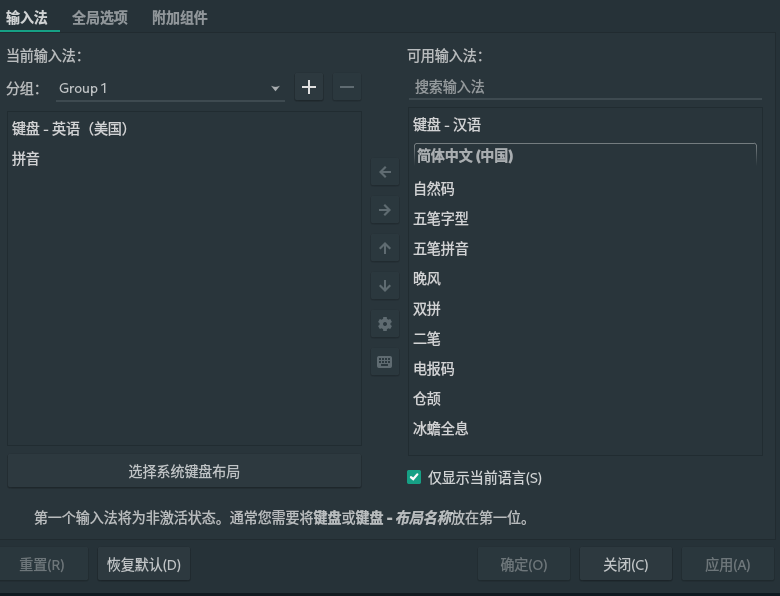

## 换源

```shell
sudo pacman-mirrors -i -c China -m rank
```

或者自动选择

```shell
pacman-mirrors -c China
```

或者自动选择最快的
```shell
pacman-mirrors --fasttrack
```

## 安装 Yay
```shell
sudo pacman -Sy yay
```

## 安装字体
```shell
yay -Sy wqy-zenhei wqy-microhei adobe-source-han-sans-otc-fonts tty-font-awesome tty-cascadia-code nerd-fonts-cascadia-code ttf-material-icons
```

## 输入法

```shell
sudo pacman -Sy fcitx5 fcitx5-chinese-addons fcitx5-qt fcitx5-gtk
```

fcitx5 是输入法框架，默认支持英文。
fcitx5-chinese-addons 是中文支持。

### 配置环境变量

```shell
sudo vim ~/.pam_environment
```

输入：
```
INPUT_METHOD  DEFAULT=fcitx5
GTK_IM_MODULE DEFAULT=fcitx5
QT_IM_MODULE  DEFAULT=fcitx5
XMODIFIERS    DEFAULT=\@im=fcitx5
```

### 配置自启动

```shell
sudo cp /usr/share/applications/org.fcitx.Fcitx5.desktop /etc/xdg/autostart/
```
/usr/share/applications 下可能不是叫 `org.fcitx.Fcitx5.desktop`，可能是 `fcitx5.desktop`，自己看下。

### 选择
注销重启，在菜单栏右键选择一个 `键盘-英语`，再选一个 `拼音`



### 设置

- 翻页
```shell
sudo vim ~/.config/fcitx5/conf/pinyin.conf

# 翻页
[PrevPage]
0=minus
1=comma

[NextPage]
0=equal
1=period
```

- 主题

```shell
sudo pacman -S fcitx5-material-color
```

配置主题
```shell
# ~/.config/fcitx5/conf/classicui.conf

# 垂直候选列表
Vertical Candidate List=False
# 按屏幕DPI使用
PerScreenDPI=True
# Font (设置成自己喜欢的，前提是安装了字体)
Font="Source Han Sans Medium 13"

# 主题
Theme=Material-Color-Blue
```

字体名字可以到 `/usr/share/fontconfig/conf.default/` 下，用 vim 打开查看。fontconfig.match.test.string 里就是正确的名字。
```xml
<?xml version="1.0" encoding="UTF-8"?>
<!DOCTYPE fontconfig SYSTEM "../fonts.dtd">
<fontconfig>
        <match target="scan">
                <test name="fullname" compare="eq">
                        <string>Source Han Sans Medium</string>
                </test>
                <edit name="weight" mode="assign">
                        <const>demibold</const>
                </edit>
        </match>
        <match target="scan">
                <test name="fullname" compare="eq">
                        <string>Source Han Sans K Medium</string>
                </test>
                ...
```


[GitHub Fcitx5-Material-Color](https://github.com/hosxy/Fcitx5-Material-Color)

[AUR WIKI](https://wiki.archlinux.org/title/Fcitx5_(%E7%AE%80%E4%BD%93%E4%B8%AD%E6%96%87))


## NeoVIM

```shell
yay -Sy nvim
```

推荐配置：[nvimdots](https://github.com/ayamir/nvimdots)

## 科学上网

[v2raya](https://v2raya.org/docs/prologue/introduction/)

## 其他软件

- flameshot 截图
```shell
yay -Sy flameshot
```

- timeshift 备份回滚
```shell
yay -Sy timeshift
```

- Alacritty TTY工具
```shell 
yay -S alacritty
```

[GitHub Alacritty](https://github.com/alacritty/alacritty)

Config: ～/.config/alacritty/

- Polybar 菜单栏

```shell
yay -Sy polybar
```

WIKI: [GitHub polybar](https://github.com/polybar/polybar)

- Picom 半透明效果

```shell
yay -Sy picom
```

- 墙纸

~/.wallpapers

```shell
yay -Sy feh
```

- Rofi 快捷启动+切换
```shell
yay -Sy rofi
```

[GitHub Rofi](https://github.com/davatorium/rofi)

- Ranger 文件浏览器

- fzf 文件搜索

- 音频管理

- nmcli 网络管理

- light 亮度管理

- xrandr 外接显示设备管理


## Q&A

Q: 安装以后 terminal 中文显示正常，但是其他 GUI 的地方中文不显示
A: 安装 adobe-source-han-sans-otc-fonts 字体
```shell
yay -Sy adobe-source-han-sans-otc-fonts
```


# Pacman 命令

## 安装软件
|       命令                                                | 描述                                          |
|----------------------------------------------------------|-----------------------------------------------|
| pacman -S 软件名                                          | 安装软件。也可以同时安装多个包，只需以空格分隔包名即可。|
| pacman -S --needed 软件名1 软件名2                         | 安装软件，但不重新安装已经是最新的软件。|
| pacman -Sy 软件名                                         | 安装软件前，先从远程仓库下载软件包数据库(数据库即所有软件列表)。|
| pacman -Sv 软件名                                         | 在显示一些操作信息后执行安装。|
| pacman -Sw 软件名                                         | 只下载软件包，不安装。|
| pacman -U 软件名.pkg.tar.gz                               | 安装本地软件包。|
| pacman -U http://www.example.com/repo/example.pkg.tar.xz | 安装一个远程包（不在 pacman 配置的源里面）。|


## 卸载软件
|       命令         | 描述                                          |
|-------------------|-----------------------------------------------|
| pacman -R 软件名   | 该命令将只删除包，保留其全部已经安装的依赖关系 |
| pacman -Rv 软件名  | 删除软件，并显示详细的信息                  |
| pacman -Rs 软件名  | 删除软件，同时删除本机上只有该软件依赖的软件。 |
| pacman -Rsc 软件名 | 删除软件，并删除所有依赖这个软件的程序，慎用  |
| pacman -Ru 软件名  | 删除软件,同时删除不再被任何软件所需要的依赖   |


## 搜索软件

|       命令         | 描述                                          |
|-------------------|--------------------------------------------|
| pacman -Ss 关键字  | 在仓库中搜索含关键字的软件包（本地已安装的会标记）                        |
| pacman -Sl <repo> | 显示软件仓库中所有软件的列表，可以省略，通常这样用:`pacman -Sl | 关键字`   |
| pacman -Qs 关键字  | 搜索已安装的软件包                                                    |
| pacman -Qu        | 列出所有可升级的软件包                                                 
| pacman -Qt        | 列出不被任何软件要求的软件包                                           |

参数加q可以简洁方式显示结果，比如pacman -Ssq gcc会比pacman -Ss gcc显示的好看一些。

> pacman -Sl | gcc跟pacman -Ssq gcc很接近，但是会少一些和gcc有关但软件名不包含gcc的包。

查询软件信息
|       命令         | 描述                                          |
|-------------------|--------------------------------------------|
| pacman -Q 软件名  | 查看软件包是否已安装，已安装则显示软件包名称和版本                   |
| pacman -Qi 软件名 | 查看某个软件包信息，显示较为详细的信息，包括描述、构架、依赖、大小等等  |
| pacman -Ql 软件名 | 列出软件包内所有文件，包括软件安装的每个文件、文件夹的名称和路径       |

## 更新系统
- pacman -Sy: 从服务器下载新的软件包数据库（实际上就是下载远程仓库最新软件列表到本地）。
- pacman -Su: 升级所有已安装的软件包。
- pacman 可以用一个命令就可以升级整个系统。花费的时间取决于系统有多老。这个命令会同步非本地(local)软件仓库并升级系统的软件包：pacman -Syu

## 软件包组
|       命令         | 描述                                          |
|-------------------|--------------------------------------------|
| pacman -Sg         | 列出软件仓库上所有的软件包组     |
| pacman -Qg         | 列出本地已经安装的软件包组和子包  |
| pacman -Sg 软件包组 | 查看某软件包组所包含的所有软件包  |
| pacman -Qg 软件包组 | 和pacman -Sg 软件包组完全一样   |

很多人建议通过安装软件组来安装工具链，例如：

- pacman -S mingw-w64-x86_64-toolchain
- pacman -S mingw-w64-i686-toolchain
- pacman -S mingw-w64-x86_64-qt5
- pacman -S base-devel

## 清理缓存
- pacman -Sc：清理未安装的包文件，包文件位于 /var/cache/pacman/pkg/ 目录。
- pacman -Scc：清理所有的缓存文件


## 常用命令
|       命令         | 描述                                                    |
|-------------------|---------------------------------------------------------|
| pacman -Syu       | 升级系统及所有已经安装的软件。                              |
| pacman -S 软件名   | 安装软件。也可以同时安装多个包，只需以空格分隔包名即可。        |
| pacman -Rs 软件名  | 删除软件，同时删除本机上只有该软件依赖的软件。                |
| pacman -Ru 软件名   | 删除软件，同时删除不再被任何软件所需要的依赖。               |
| pacman -Ssq 关键字 | 在仓库中搜索含关键字的软件包，并用简洁方式显示。              |
| pacman -Qs 关键字  | 搜索已安装的软件包。                                      |
| pacman -Qi 软件名   | 查看某个软件包信息，显示软件简介,构架,依赖,大小等详细信息。    |
| pacman -Sg         | 列出软件仓库上所有的软件包组。                              |
| pacman -Sg 软件包组 | 查看某软件包组所包含的所有软件包。                           |
| pacman -Sc         | 清理未安装的包文件，包文件位于 /var/cache/pacman/pkg/ 目录。 |
| pacman -Scc        | 清理所有的缓存文件。                                       |
